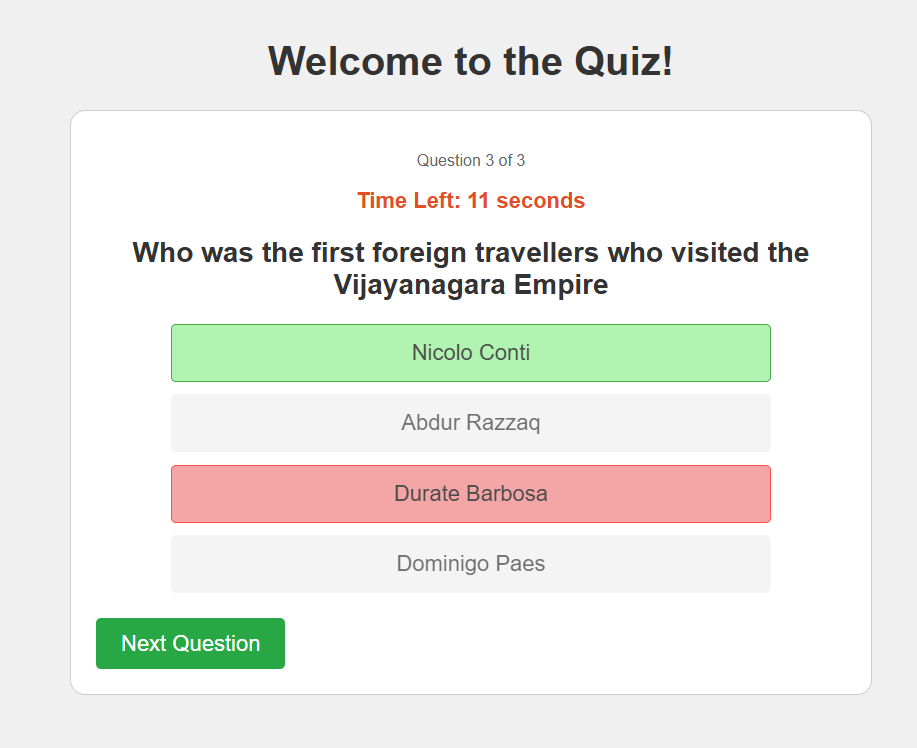
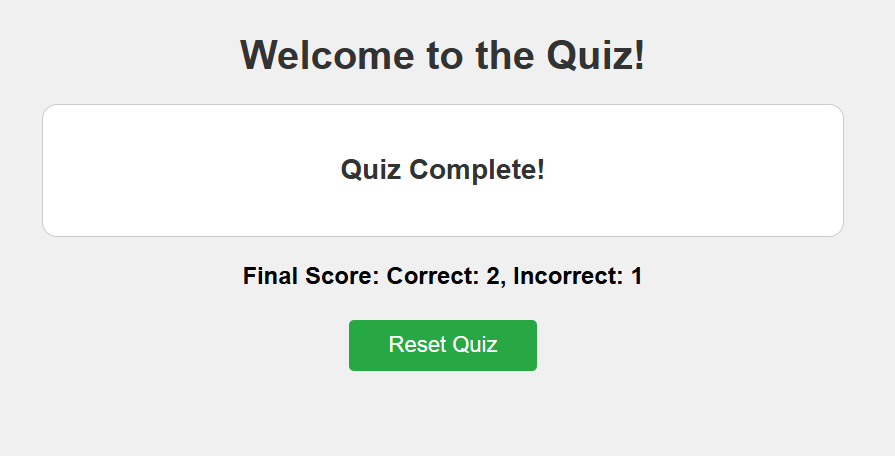

# Interactive JavaScript Quiz

<table>
  <tr>
    <td align = "center">
      
      <br>
      <em>Quiz Home Page</em>
    </td>
    <td align="center">
      
      <br>
      <em>Quiz in Progress</em>
    </td>
    <td align="center">
      
      <br>
      <em>Final Score</em>
    </td>
  </tr>
</table>

## Project Overview

This is a interactive web-based quiz application built entirely with HTML, CSS, and vanilla JavaScript. It allows users to test their knowledge on various topics with a clean user interface, real-time feedback, and a timer for added challenge.

## Features

* **Multiple Quiz Categories:** Choose from different quiz topics (e.g., Geography, Science, History, Mathematics).
* **Dynamic Question & Options Display:** Questions and their respective answer options are dynamically loaded and displayed.
* **Question Shuffling:** Questions are shuffled randomly for a fresh experience every time.
* **Interactive Timer:** Each question has a time limit, adding an element of challenge. The quiz automatically proceeds if time runs out.
* **Instant Feedback:** Users receive immediate visual feedback (green for correct, red for incorrect) on their selected answer.
* **Score Tracking:** Tracks correct and incorrect answers throughout the quiz, displaying the final score at the end.
* **Clear Reset Functionality:** Easily restart the quiz or return to the category selection screen.
* **Separation of Concerns:** Quiz data is stored in a separate JavaScript file for better organization and scalability.

## Technologies Used

* **HTML5:** For the structure of the web page.
* **CSS3:** For styling and layout.
* **JavaScript (Vanilla JS):** For all the interactive logic, DOM manipulation, timer, and quiz flow.

## How to Run Locally

Follow these simple steps to get the quiz running on your local machine:

1.  **Clone the repository:**
    ```bash
    git clone https://github.com/Chitrashree0910/Interactive_Quiz.git
    ```

2.  **Navigate to the project directory:**
    ```bash
    cd Interactive_Quiz
    ```

3.  **Open `index.html`:**
    Simply open the `index.html` file in your preferred web browser. You can usually do this by double-clicking the file.

## Project Structure
* `index.html`: The main HTML file that structures the quiz application.
* `CSS/style.css`: Contains all the styling rules for the quiz's appearance.
* `JavaScript/script.js`: Holds the core logic for the quiz functionality, including managing questions, answers, timer, and UI interactions.
* `JavaScript/quizData.js`: Stores all the quiz questions and options, separated by category.
